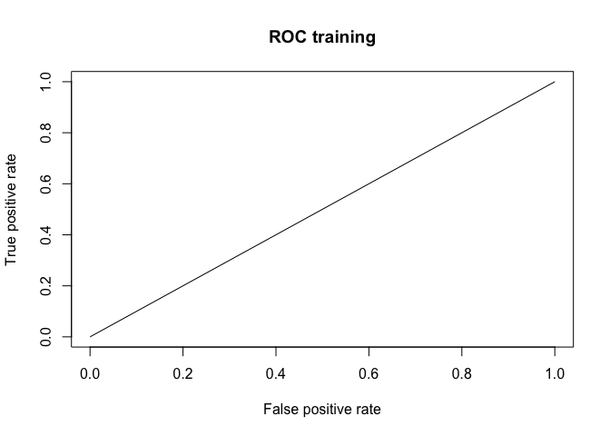

**1 - Import the brand dataset. For each individual, we collect, its Age, its Gender and the Brand he prefers, either M1 or M2.**


```r
brands <- read.csv("data/brand.csv")
summary(brands)
```

```
##        X         Brand    Gender       Age      
##  Min.   :  1.0   M1:207   F:323   Min.   :24.0  
##  1st Qu.:129.2   M2:307   M:191   1st Qu.:32.0  
##  Median :257.5                    Median :32.0  
##  Mean   :257.5                    Mean   :32.3  
##  3rd Qu.:385.8                    3rd Qu.:33.0  
##  Max.   :514.0                    Max.   :38.0
```

**2 - The aim of the study is to assess the impact of Age and Gender on the preference for a brand.Suggest and write a model to answer this question by specifying what is fixed and what is random.**

We treat age and gender as fixed (the explanatory variables), and brand preference as variable (the dependent variable).

Because the response is a binary categorical variable, we choose to fit a logistic regression. Specifically, we will the following model.

$$\log(\frac{p_i}{1-p_i}) = \beta_0 + \beta_1 * 1_{gender = M} +\beta_2 * age  $$
Where $p_i$ represents the probability that individual i prefers brand M2 (So we want to encode M1 as a 0 response, and M2 as a 1 response). Note also that for the categorical variable gender, female is the baseline category.  

**3 - Estimate the parameters by maximum likelihood and give the values of the estimated parameters.**


```r
res.logit <- glm(Brand ~ Gender + Age, data = brands, family = binomial(link = "logit"))
(names(res.logit))
```

```
##  [1] "coefficients"      "residuals"         "fitted.values"    
##  [4] "effects"           "R"                 "rank"             
##  [7] "qr"                "family"            "linear.predictors"
## [10] "deviance"          "aic"               "null.deviance"    
## [13] "iter"              "weights"           "prior.weights"    
## [16] "df.residual"       "df.null"           "y"                
## [19] "converged"         "boundary"          "model"            
## [22] "call"              "formula"           "terms"            
## [25] "data"              "offset"            "control"          
## [28] "method"            "contrasts"         "xlevels"
```

```r
head(res.logit$y)
```

```
## 1 2 3 4 5 6 
## 0 0 0 0 0 0
```

So we see that brand M1 is treated as a 0-response , as wanted.  
We can find the model parameters in the regression summary.


```r
summary(res.logit)
```

```
## 
## Call:
## glm(formula = Brand ~ Gender + Age, family = binomial(link = "logit"), 
##     data = brands)
## 
## Deviance Residuals: 
##     Min       1Q   Median       3Q      Max  
## -2.4407  -1.1743   0.6842   0.9598   1.7119  
## 
## Coefficients:
##              Estimate Std. Error z value Pr(>|z|)    
## (Intercept) -12.21229    1.91519  -6.377 1.81e-10 ***
## GenderM      -0.54338    0.19755  -2.751  0.00595 ** 
## Age           0.39838    0.05974   6.669 2.58e-11 ***
## ---
## Signif. codes:  0 '***' 0.001 '**' 0.01 '*' 0.05 '.' 0.1 ' ' 1
## 
## (Dispersion parameter for binomial family taken to be 1)
## 
##     Null deviance: 692.98  on 513  degrees of freedom
## Residual deviance: 625.72  on 511  degrees of freedom
## AIC: 631.72
## 
## Number of Fisher Scoring iterations: 4
```

And we see that female was treated as the baseline category, as wanted. The fitted model is as follows:

$$\log(\frac{p_i}{1-p_i}) = -12.21 + -0.5434 * 1_{gender = M} +0.3984 * age  $$

**4 - Is there a significant relationship between age and the preferences? Justify your answer by writing the appropriate test and by giving the R output. Retrieve the value of the p.value that is given in the R output, by computing the test in R.**

We see from the regression summary that there is a very significant relationship between age and brand choice (the p-value is 2.58e-11, which is highly significant). We should retrieve this value by using the Wald test. The test is as follows:

To test $H_0:\hat{\beta_j} = 0$ against $H_1:\hat{\beta_j} \neq 0$, we use:
$$Z_j = \frac{\hat{\beta_j}}{\hat{\sigma_j}} \sim N(0,1)$$

Let us first compute the test statistic for the Wald test.  


```r
Z <- summary(res.logit)$coefficients[3,1]/summary(res.logit)$coefficients[3,2]
Z
```

```
## [1] 6.668826
```

And now we can find the p-value by computing the probability of drawing this value from a standard normal distribution.


```r
pnorm(Z,lower.tail = FALSE)
```

```
## [1] 1.289289e-11
```

We have retrieved the p-value from the regression summary. Once again, this p-value is highly significant, which means we are confident that there is a significant effect of age on brand preference.

**5 - How do you interpret the coefficient for the age? Give a confidence interval for the associated odds-ratio.**

The coefficient can be understood as representing the increase in the log odds of the response for a 1 unit increase in age, all other variables held constant.  
Alternatively, we can say this coefficient represents the *multiplicative* increase in the odds ratio, for a one-unit increase in age.

A 95 % confidence interval for the age coefficient is :

```r
ci_age <- confint.default(res.logit)[3,]
ci_age
```

```
##     2.5 %    97.5 % 
## 0.2812991 0.5154687
```

And so the associatied 95% confidence interval for the odds ratio is:

$$\frac{p_i}{1-p_i} \in [e^{-12.21 + -0.5434 * 1_{gender = M} +0.2813 * age} ; e^{-12.21 + -0.5434 * 1_{gender = M} +0.5155 * age}]$$

**6 - What is the probability of preferring brand M2 for a women of age 34?**

Here is how we compute probabilities from a logistic model:

$$p_i = \frac{e^{x_i\hat{\beta}}}{1+e^{x_i\hat{\beta}}}$$
We can use the predict.glm function in R.


```r
Age <- 34
Gender <- "F"
new_value <- as.data.frame(cbind(as.numeric(Age),Gender))
predict.glm(res.logit, newdata = new_value, type = "response")
```

```
##         1 
## 0.7912973
```

And so for this individual, there is a 79% probability of preferring brand M2.

**7 - What is the difference between men and women?**

For women, the model is as follows:
$$\log(\frac{p_i}{1-p_i}) = -12.21 +0.3984 * age  $$

For men, it is like this:
$$\log(\frac{p_i}{1-p_i}) = -12.21 - 0.5434+0.3984 * age  $$
We can understand it as follows: men are less likely to prefer brand M2 than women.
Specifically, the log-odds for men is lower than the log-odds for women by $.5434$ (additive difference)  
$$\log(\frac{p_M}{1-p_M}) = log(\frac{p_F}{1-p_F}) - 0.5434$$
Taking the exponential, we find that:
$$\frac{p_M}{1-p_M} = \frac{p_M}{1-p_M}* e^{-0.5434}$$
That is, the odds of men preferring M2 is lower than the odds of women preferring M2 by a multiplicative factor of $e^{-0.5434}$

**8 - With your model, is it possible to know if the effect of Age on the preferences is the same for both men and women? If not suggest and fit a solution to answer this question.**

No, our model does not capture the interaction of Age and Gender. To answer this solution we fit a logistic regression with interactions.


```r
res.logit2 <- glm(Brand ~ Gender * Age, data = brands, family = binomial(link = "logit"))
summary(res.logit2)
```

```
## 
## Call:
## glm(formula = Brand ~ Gender * Age, family = binomial(link = "logit"), 
##     data = brands)
## 
## Deviance Residuals: 
##     Min       1Q   Median       3Q      Max  
## -2.3490  -1.1700   0.6768   0.9598   1.7966  
## 
## Coefficients:
##              Estimate Std. Error z value Pr(>|z|)    
## (Intercept) -10.96947    2.41937  -4.534 5.79e-06 ***
## GenderM      -3.70935    4.01711  -0.923    0.356    
## Age           0.35955    0.07548   4.764 1.90e-06 ***
## GenderM:Age   0.09862    0.12496   0.789    0.430    
## ---
## Signif. codes:  0 '***' 0.001 '**' 0.01 '*' 0.05 '.' 0.1 ' ' 1
## 
## (Dispersion parameter for binomial family taken to be 1)
## 
##     Null deviance: 692.98  on 513  degrees of freedom
## Residual deviance: 625.08  on 510  degrees of freedom
## AIC: 633.08
## 
## Number of Fisher Scoring iterations: 4
```

The output summary indicates a positive interaction term between male gender and age, which would indicate that the effect of age on brand preference is slightly stronger for men than women. However, this coefficient is far from statistically  significant (p-value .43). So we cannot conclude that it is different from zero.  
We say that the effect of age on preferences is not statistically different for men than women.

**9 - To compare the effect of age on the probability to prefer a brand, you could also represent graphically for each Gender the probability of selecting Brand 2 as a function of Age. Comment such a representation.**


```r
library(ggplot2)
library(dplyr)
```

```
## 
## Attaching package: 'dplyr'
```

```
## The following objects are masked from 'package:stats':
## 
##     filter, lag
```

```
## The following objects are masked from 'package:base':
## 
##     intersect, setdiff, setequal, union
```

```r
pred <- predict(res.logit, type = "response")
don <- cbind.data.frame(brands, pred)

ggplot(don) +  
  geom_line(aes(x = Age, y = pred, group = Gender, color = Gender)) +
  geom_point(aes(x= Age, y = as.numeric(Brand=="M2"))) 
```

<!-- -->

What we see on this graph is consistent what we said above: the slope of the predicted probabilities for men is slightly stronger than for women, indicating that there is a stronger effect of age on brand preference for men than for women. However, this difference in slope is very subtle, and as we have seen in question 9, it is not statistically different from 0.

**10 - A method to compare two models consists in the Likelihood ratio test. The likelihood ratio test compares the log-likelihood of two models. For two nested models $M_1 \subset M_2$, under the null hpothesis that $M_1$ is kept against $M_2$,**

We will use a Likelihood Ratio Test to see if our first model is significantly better than an intercept only model.

The intercept only model is the following: 

```r
reg.init <- glm(Brand ~ 1, data = brands, family = "binomial")
summary(reg.init)
```

```
## 
## Call:
## glm(formula = Brand ~ 1, family = "binomial", data = brands)
## 
## Deviance Residuals: 
##    Min      1Q  Median      3Q     Max  
## -1.349  -1.349   1.015   1.015   1.015  
## 
## Coefficients:
##             Estimate Std. Error z value Pr(>|z|)    
## (Intercept)  0.39413    0.08993   4.382 1.17e-05 ***
## ---
## Signif. codes:  0 '***' 0.001 '**' 0.01 '*' 0.05 '.' 0.1 ' ' 1
## 
## (Dispersion parameter for binomial family taken to be 1)
## 
##     Null deviance: 692.98  on 513  degrees of freedom
## Residual deviance: 692.98  on 513  degrees of freedom
## AIC: 694.98
## 
## Number of Fisher Scoring iterations: 4
```

And we can compare it to our original model using a LRT.


```r
anova(reg.init, res.logit, test = "LR")
```

```
## Analysis of Deviance Table
## 
## Model 1: Brand ~ 1
## Model 2: Brand ~ Gender + Age
##   Resid. Df Resid. Dev Df Deviance  Pr(>Chi)    
## 1       513     692.98                          
## 2       511     625.72  2   67.255 2.488e-15 ***
## ---
## Signif. codes:  0 '***' 0.001 '**' 0.01 '*' 0.05 '.' 0.1 ' ' 1
```

The output tells us that the intercept only model has a residual deviance of 692.98 while our model has a residual deviance of 625.72. This means that our model reduces the residual deviance by 67.255 while only adding two coefficients to the model. Comparing this statistic to a Chi-square distribution with two degrees of freedom, we see that the more complex model is significantly better (p-value is 2.488e-15).

We can retrieve these values like this:


```r
logLik(reg.init)
```

```
## 'log Lik.' -346.4877 (df=1)
```

```r
logLik(res.logit)
```

```
## 'log Lik.' -312.8602 (df=3)
```

```r
C <- -2*(logLik(reg.init)[1]-logLik(res.logit)[1])
C
```

```
## [1] 67.25499
```
Here we have calculated the test statistic, which follows a chi-square distribution with $p_2 - p_1 = 3-1 = 2$ degrees of freedom.


```r
pchisq(C, 2, lower.tail = FALSE)
```

```
## [1] 2.487507e-15
```
And we retrieve the result from the anova function. We reject the null hypothesis and choose the more complex model as the better model.

**11 - Suggest another way to compare two models, in particular if you are interested in their prediction capacities.**

There are many ways to compare two models, for example the Aikake Information Criterion (AIC)


```r
print("Complex model AIC")
```

```
## [1] "Complex model AIC"
```

```r
summary(res.logit)$aic
```

```
## [1] 631.7204
```

```r
print("Intercept only model AIC")
```

```
## [1] "Intercept only model AIC"
```

```r
summary(reg.init)$aic
```

```
## [1] 694.9754
```
We want the lowest possible AIC so we would choose the complex model.

If we are interested in prediction capacities we could also look at the area under the ROC curve for both models.

*For the complex model:*


```r
library(ROCR)
```

```
## Loading required package: gplots
```

```
## 
## Attaching package: 'gplots'
```

```
## The following object is masked from 'package:stats':
## 
##     lowess
```

```r
p <- predict(res.logit, type = "response")
pr <- prediction(p, brands$Brand)
prf <- performance(pr, measure = "tpr", x.measure = "fpr")
plot(prf, colorize = FALSE, main = "ROC training")
```

<!-- -->

```r
auc <- performance(pr, measure = "auc")
auc <- auc@y.values[[1]]
print(paste("The AUC is", auc ) )
```

```
## [1] "The AUC is 0.699609749956726"
```

*For the intercept only model*


```r
library(ROCR)
p <- predict(reg.init, type = "response")
pr <- prediction(p, brands$Brand)
prf <- performance(pr, measure = "tpr", x.measure = "fpr")
plot(prf, colorize = FALSE, main = "ROC training")
```

<!-- -->

```r
auc <- performance(pr, measure = "auc")
auc <- auc@y.values[[1]]
print(paste("The AUC is", auc ) )
```

```
## [1] "The AUC is 0.5"
```

And so the area under the curve is higher for the complex model than for the intercept-only model: complex model has better prediction capabilities than the intercept-only model.
